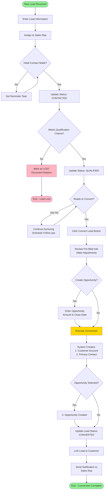
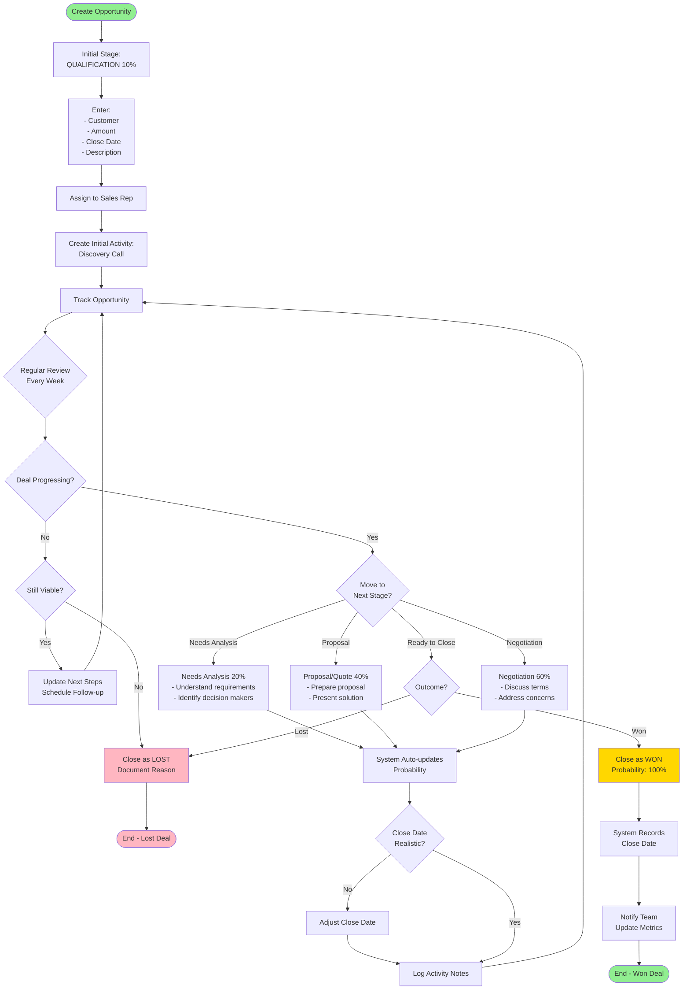
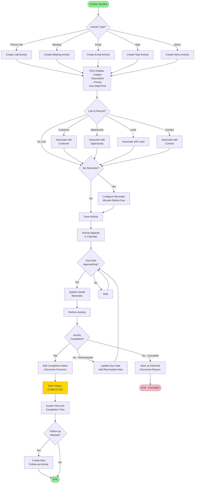
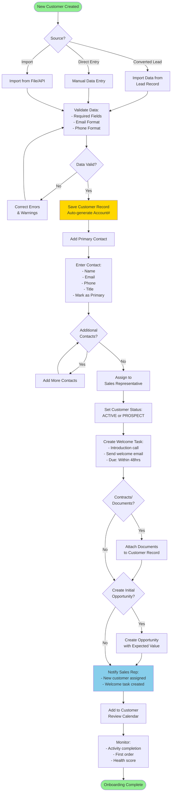
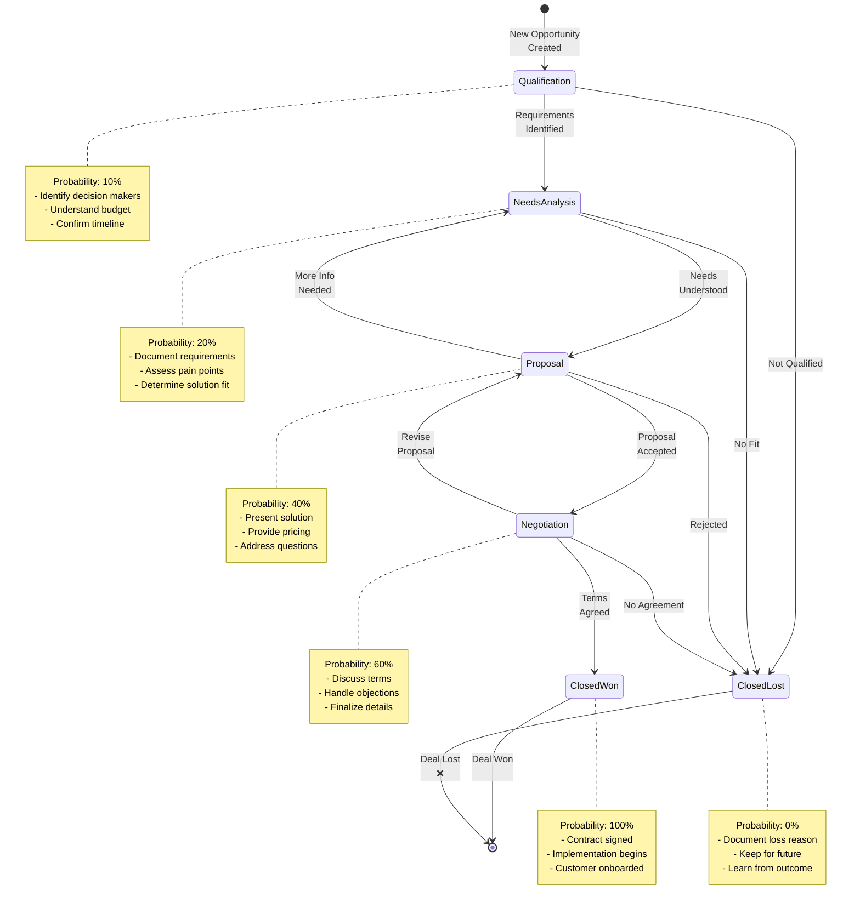

# CRM Application - Process Flow Diagrams

## Table of Contents
1. [Lead to Customer Conversion Process](#1-lead-to-customer-conversion-process)
2. [Opportunity Management Process](#2-opportunity-management-process)
3. [Activity Management Workflow](#3-activity-management-workflow)
4. [Customer Onboarding Process](#4-customer-onboarding-process)
5. [Sales Pipeline Progression](#5-sales-pipeline-progression)

---

## 1. Lead to Customer Conversion Process

---

## 2. Opportunity Management Process

---

## 3. Activity Management Workflow

---

## 4. Customer Onboarding Process

---

## 5. Sales Pipeline Progression

---

## Additional Process Notes

### Automation Triggers
1. **Lead Assignment:** Auto-assign based on territory/round-robin
2. **Opportunity Updates:** Probability auto-updates with stage changes
3. **Activity Reminders:** System sends reminders before due date
4. **Audit Trail:** All changes automatically logged
5. **Email Notifications:** Stakeholders notified of key events

### Validation Rules
1. **Lead Conversion:** Cannot convert already converted lead
2. **Opportunity Amount:** Must be positive value
3. **Close Date:** Cannot be in the past for new opportunities
4. **Primary Contact:** Only one per customer
5. **Required Fields:** Enforced before save

### Integration Points
1. **Email System:** Activity creation triggers email
2. **Calendar:** Activities sync to calendar
3. **Reporting:** Real-time dashboard updates
4. **External CRM:** API for data exchange
5. **Marketing Automation:** Lead source tracking

---

*Process Documentation Version: 1.0*  
*Last Updated: February 14, 2026*
